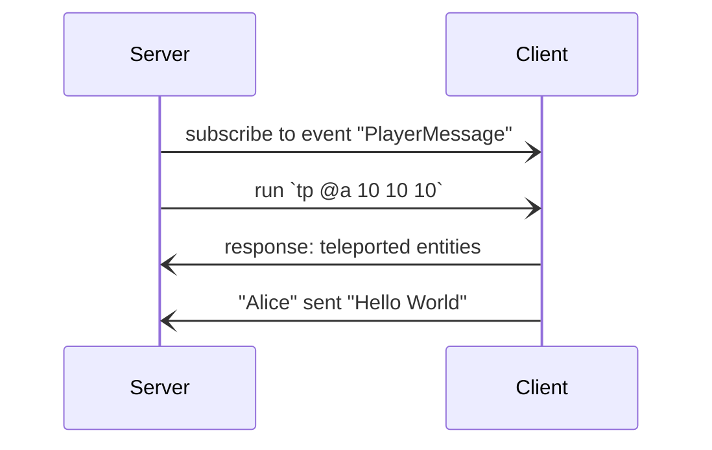

# Bedrock Websockets

Websockets are a natively supported way for a server communicating with a player in
Minecraft.


## How does it work?



Implementing servers that handle events takes a long time and is very inconvenient so
we try to implement wrappers around it in different programming languages. At the moment
only Python is supported.

- [🐍 Python](https://github.com/bedrock-ws/bedrockpy)

After you have started a server you can connect to it via the `/wsserver` (or its alias
`/connect`) command by typing it in the Minecraft chat.

```ruby
/connect localhost:6464
```


## Other things we do

Because websockets in Minecraft are not maintained anymore and have never been officially
documented we will provide a (digital) book going in-depth how websockets in Minecraft
work so the implementation in other programming languages can be done more easily.

Some applications that work with websockets are published here as well.
