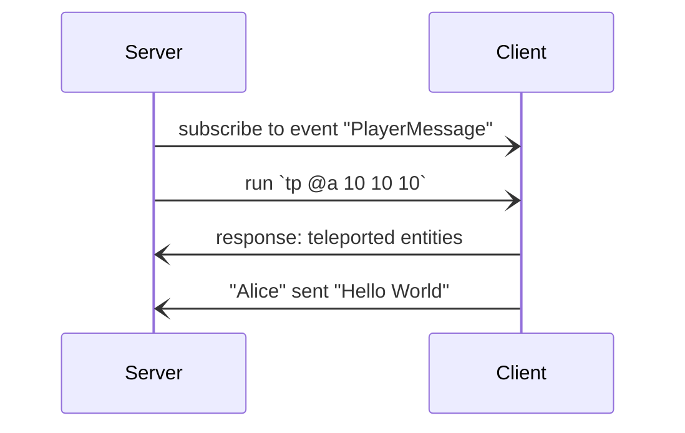

# Minecraft: Bedrock Edition WebSockets

Websockets are a natively supported way for a server communicating with a player in
Minecraft. The official Script API of Minecraft however is generally preferred over
using a websocket connection. Here are some major reasons why you would use websockets
instead of a Script API:

- programmatically modify/manage a Minecraft world hosted on a console[^1]
- use another language than JavaScript (or one that transpiles to JavaScript)[^2]

[^1]: Console players (Playstation/XBox/Switch/...) cannot download behaviour
      packs from sources other than the Marketplace Store. Because connecting
      to a websocket server is also not possible, it is required to join that
      world on a mobile or desktop device.

[^2]: Keep in mind that the functionality is very limited with websockets compared
      to the Script API. If your project relies on something that cannot be done
      with JavaScript for example using some library that is only present in a
      different language.

      JavaScript is not that hard and it can be fun and useful to learn an entire new
      programming language. You may as well take a look at [TypeScript](https://www.typescriptlang.org).

> [!WARNING]
>
> Websockets are not natively supported on every device that runs Minecraft. Establishing
> a connection to a websocket server is only possible on mobile and desktop devices and
> not consoles. However another player is able to be connected to the server which then
> is capable of running commands in that world.

## How does it work?



> [!NOTE]
>
> The server can only listen to events that the client triggers. For example if another
> player sends a message in the chat, the event `PlayerMessage` is not triggered. The
> server also runs commands *as* the client which means that `@s` refers to the player
> connected to the server and relative coordinates are relative to that player. More
> players may connect to the same server but this has not been tried out yet so feel
> free to let us know if it works.

Implementing servers that handle events takes a long time and is very inconvenient so
we try to implement wrappers around it in different programming languages. At the moment
only Python, Dart, TypeScript and JavaScript are supported.

- [TypeScript/JavaScript](https://github.com/bedrock-ws/bedrockws-deno)
- [Python](https://github.com/bedrock-ws/bedrockpy)
- [Dart](https://github.com/bedrock-ws/bedrockws-dart)

After you have started a server you can connect to it via the `/wsserver` (or its alias
`/connect`) command by typing it in the Minecraft chat.

```ruby
/connect localhost:6464
```


## Other things we do

Because websockets in Minecraft are not maintained anymore and have never been officially
documented we will provide a (digital) book going in-depth how websockets in Minecraft
work so the implementation in other programming languages can be done more easily.

Some applications that work with websockets are published here as well.
